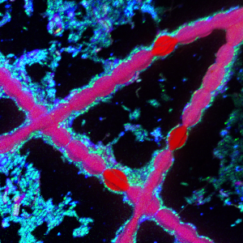

# Look@NanoSIMS

Look@NanoSIMS (abbreviated as **LANS**) is a software tool for the analysis of NanoSIMS image data acquired by the Cameca NanoSIMS 50L instrument. Although the software itself is [free](http://www.gnu.org/philosophy/free-sw.html), it is distributed as a Matlab code and thus requires a working installation of Matlab (proprietary software) to run.

The software is written and maintained by Lubos Polerecky (LP). The development started in 2008, at the time when LP worked at the Max-Planck Institute for Marine Microbiology in Bremen, Germany. Since 2013, LP continues with the development of the program as part of his permanent employment at Utrecht University in the Netherlands.

Although LANS has matured pretty well over the years, it may still contain bugs or lack features that you might find useful. If you experience problems, find a bug, or would like to have a new feature added to LANS, you can contact LP via email - he will be happy to work with you to fix the issues or improve the program. 

Contact detail: `l (dot) polerecky (at) uu (dot) nl`

**Current version: 2025-07-27**

## Features, functions, and types of output

1. **Loading** of secondary ion counts (SIC) image data (Cameca `im` files)
   
    - all or selected planes and masses (including data acquired using a peak-switching mode)
    - loading of data in blocks
    - merging of multiple `im` files
    - possibility to apply dead-time and QSA corrections
    - loading of compressed data (`im.zip` files, roughly 10% size of the original `im` files)
    - loading of data processed and exported by LANS (`mat` files)

2. **Drift-correction** and **accumulation** of planes

    - based on a specific mass and area within the image

3. **Regions of interest (ROIs)**

    - manual and semi-automated ROI definition
    - manual and semi-automated ROI classification (e.g., based on a logical expression)

4. Quantification and export of **ion count ratios** 

    - ratios defined through an expression (e.g., 13C/12C, 13C/(12C+13C), 0.5*12C13C/12C2)
    - ROI-specific ratios (scatter plots, color-coded based on ROI classification)
    - ratio images (various colormaps, inclusion of ROI outlines, hue intensity modulation)
    - depth profiles in ROIs 
    - lateral profiles (including their variation over depth)
    - histograms
    - image overlays (combined into an RGB image or a 3D surface plot)
    - results exported as text and graphics

5. **Statistical analysis** of data in ROIs 
    
    - comparison of ROIs
    - comparison of ROI classes
    - comparison of experimental treatments or time-points

6. Processing of **multiple** nanoSIMS datasets (aka "metafile processing")

    - interactive scatter plots
    - images and image overlays
    - statistical analysis of ROIs, ROI classes, and treatments
    - depth profiles in ROIs
    - auto-reprocessing of previously processed datasets

7. Correlative analysis of NanoSIMS and **external** images (e.g., TEM, SEM, AFM, fluorescence)

    - import of external images (TIF, BMP, PNG)
    - image alignment done within LANS
    - resampling of NanoSIMS images to match the resolution of the external image

## User manual

Updated LANS manual (2025) is available from this [Dropbox folder](https://www.dropbox.com/sh/gyss2uvv5ggu2vl/AABViAmt9WHryEP_xZBrCG_La?dl=0) (sub-folder `manual`).

## Download LANS

  - For convenience, the compressed file containing the latest version of LANS is stored in this [Dropbox folder](https://www.dropbox.com/sh/gyss2uvv5ggu2vl/AABViAmt9WHryEP_xZBrCG_La?dl=0). Click on the `program` folder and then download the file `LANS-latest-src.zip`.
  - If you are familiar with `git`, you can pull the source code of LANS from this github repository; the complete source code is in the [src](src) folder.

## Update LANS

  - Updating LANS to the newest version is easy: in the Matlab console, navigate to the folder of your current LANS version, and enter `lans_webupdate`.

## Install LANS

Refer to the **manual** for detailed instructions on how to install LANS on your computer. The key steps include:

    - Install Matlab (recommended version: 2024b).
    - Install LaTeX (visit [this website](https://www.latex-project.org/get/) for details).
    - Install data compression software (recommended: **7-Zip** for Windows, **zip** and **unzip** for Linux and MacOS).
    - Download LANS source code (see above).
    - Unzip the file `LANS-latest-src.zip` to a folder on your computer. 
    - Rename the `src` folder to a more reasoname name (e.g., `LANS-2025-07-27`).

## Run LANS

Refer to the **manual** for more detailed instructions. The basic steps include:

    - Start Matlab and set the current folder to the folder with the LANS source code.
    - Enter `lookatnanosims` in the Matlab console. This should open the main LANS 
      graphical user interface, as shown below. You can start from there, as explained in the manual.

  

## Acknowledgement

Please include the following citation if you used LANS in your work. 

  - L. Polerecky, B. Adam, J. Milucka, N. Musat, T. Vagner, M. M. M. Kuypers (2012). 
Look@NanoSIMS – a tool for the analysis of nanoSIMS data in environmental microbiology. 
Environmental Microbiology 14 (4): 1009–1023.
[DOI:10.1111/j.1462-2920.2011.02681.x](http://onlinelibrary.wiley.com/doi/10.1111/j.1462-2920.2011.02681.x/abstract)

