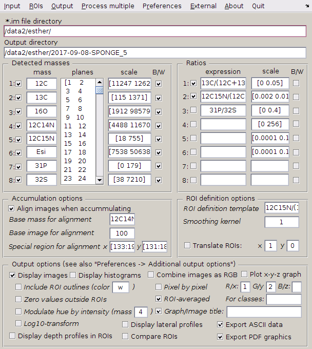

# Look@NanoSIMS

Look@NanoSIMS (abbreviated as **LANS**) is a [free software](http://www.gnu.org/philosophy/free-sw.html) 
for the analysis of NanoSIMS image data acquired by the Cameca NanoSIMS 50L instrument. It is distributed 
as a Matlab code, thus it requires a working installation of Matlab (proprietary software) to run.

The software is written and maintained by Lubos Polerecky (LP). The development started in 2008, at the 
time when LP worked at the Max-Planck Institute for Marine Microbiology in Bremen, Germany. Since 2013, LP 
continues with the development of the program as part of his permanent employment at Utrecht University in the 
Netherlands.

Although LANS has matured pretty well over the years, it may still contain bugs or lack features that you might find useful. If you experience problems, find a bug, or would like to have a new feature added to LANS, you can contact LP via email - he will be happy to work with you to fix them and improve the program. Contact detail: `l (dot) polerecky (at) uu (dot) nl`

$${\color{red}Current version: 2023-08-03}$$

## Basic features and functions

1. **Loading** of secondary ion counts (SIC) image data (Cameca `im` files)
   
    - all planes and masses (default)
    - selected planes and masses
    - planes in blocks
    - merging multiple `im` files into one dataset
    - corrections for dead-time and QSA
    - compressed data (`im.zip` files, roughly 10% size of the original `im` files)
    - data previously processed and exported by LANS (`mat`)

2. **Drift-correction** and **accumulation** of planes

    - based on a specific mass and area within the image

3. **Regions of interest (ROIs)**

    - manual and semi-automated ROI definition
    - manual and semi-automated ROI classification (e.g., based on a logical expression)

4. Quantification and export of **isotope and element ratios** 

    - ratios defined through an expression (e.g., 13C/12C, 13C/(12C+13C))
    - scatter plots of ROI-specific ratios (color-coded based on ROI classification)
    - ratio images (various colormaps, ROI outlines can be included, hue intensity can be modulated)
    - lateral and depth profiles (incl. depth variation of a lateral profile)
    - histograms
    - image overlays (combined into an RGB image or a 3D surface plot)
    - results exported as text and graphics

5. **Statistical analysis** of data in ROIs 
    
    - comparison of ROIs
    - comparison of ROI classes
    - comparison of treatments or experimental time-points

6. Processing of **multiple** nanoSIMS datasets (aka "metafile processing")

    - scatter plots (interactive)
    - images and image overlays
    - statistical analysis of ROIs, ROI classes, and treatments
    - depth profiles in ROIs
    - automated reprocessing of previously processed datasets

7. Import of *external* (third-party) images (e.g., TEM, SEM, AFM, fluorescence)

    - image alignment done within LANS

## LANS manual

LANS manuals are available from this [Dropbox folder](https://www.dropbox.com/sh/gyss2uvv5ggu2vl/AABViAmt9WHryEP_xZBrCG_La?dl=0){:target="_blank"}.

Although the original manual (`LANS-manual.pdf`) is rather old (written in 2011), it is still the *best starting point* for you to learn about LANS. Once you have learned about the basic approaches described there, you can proceed by reading the following web-pages that describe *extra features and functions* of LANS:

  - <a href="http://nanosims.geo.uu.nl/nanosims-wiki/doku.php/nanosims:lans_extras" target="_blank">New features in LANS</a>
  - <a href="http://nanosims.geo.uu.nl/nanosims-wiki/doku.php/nanosims:lans_good_to_know" target="_blank">LANS: Good to know</a>

## Download & update

  - For convenience, the compressed file containing the latest version of LANS is stored in this [Dropbox folder](https://www.dropbox.com/sh/gyss2uvv5ggu2vl/AABViAmt9WHryEP_xZBrCG_La?dl=0){:target="_blank"}. Click on the *program* folder and then select the file `LANS-latest-src.zip`.
  - If you are already using LANS, updating it to the newest version is much easier: just enter `lans_webupdate` in the Matlab console.
  - Of course, you can download LANS by pulling the source code from this repository; the complete source code is in the [src](src) folder.

## Installation instructions

1. Install Matlab. 

    - You will need the *core* Matlab and the following toolboxes: *image processing* and *statistics and machine learning*. 
    - Presently, LANS requires Matlab 2019b or newer. Using the version 2019b of Matlab is most recommended.

2. Install LaTeX. 
    
    - This software is required to enable export of graphical output as tagged PDF documents.
    - Use one of the well-known LaTeX distributions for your operating system, e.g., *texlive* (Linux), *MikTeX* (Windows), *MacTex* (MacOS).
    - What is essential to have installed and working are the following executables and packages:
        - executables: *epstopdf*, *pdflatex*
        - LaTeX packages: *graphicx*, *geometry*, *hyperref*
    
3. Install software for decompressing zip files.

	- This software is required to enable loading of compressed datasets (`im.zip` files). This is a useful feature because `im.zip` files have roughly a 10-fold lower size than the original `im` files.
    - *7-Zip* (freeware) is recommended for Windows.
    - *unzip* is available by default on Linux and MacOS systems.

4. Install and run LANS

    - Download LANS as described above.
    - Unzip `LANS-latest-src.zip` to a folder of your choice. 
    - Start Matlab and set the current folder to the LANS folder.
    - Enter `lookatnanosims` in Matlab console. This should open the main LANS 
      graphical user interface, as shown below. You can start from there, as explained in the manuals.

</img>

## Acknowledgement

Please include the following citation if you used LANS in your work. 

  - L. Polerecky, B. Adam, J. Milucka, N. Musat, T. Vagner, M. M. M. Kuypers (2012). 
Look@NanoSIMS – a tool for the analysis of nanoSIMS data in environmental microbiology. 
Environmental Microbiology 14 (4): 1009–1023.
[DOI:10.1111/j.1462-2920.2011.02681.x](http://onlinelibrary.wiley.com/doi/10.1111/j.1462-2920.2011.02681.x/abstract)

