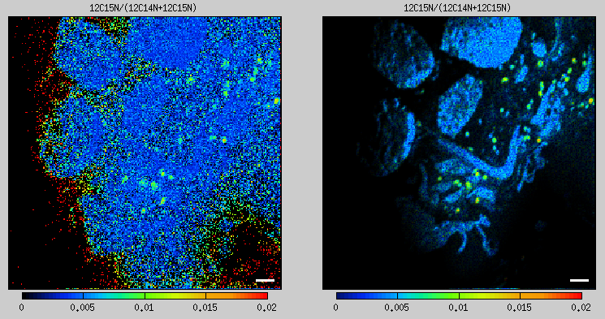
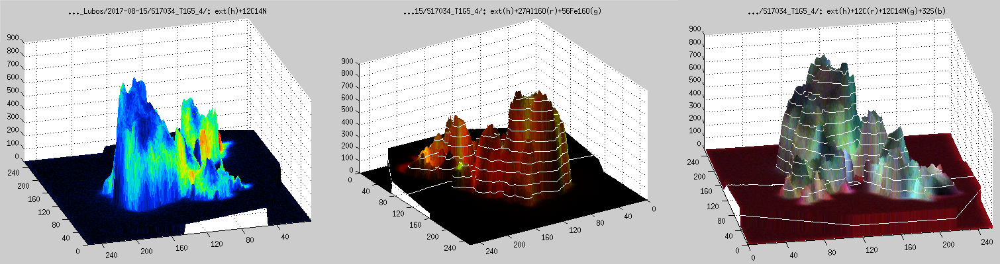
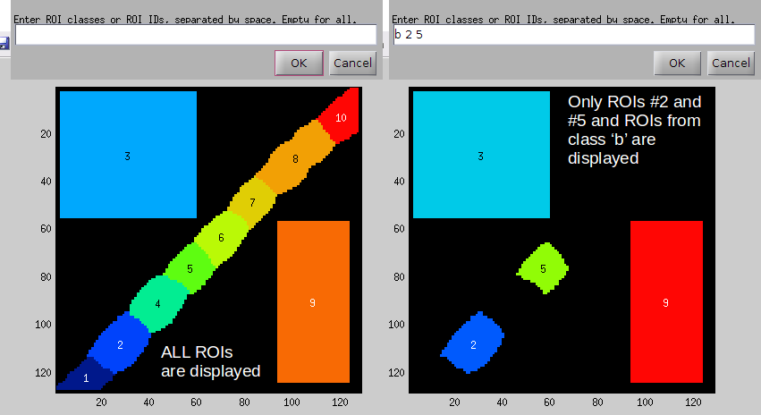
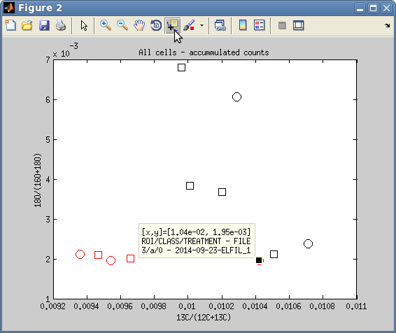
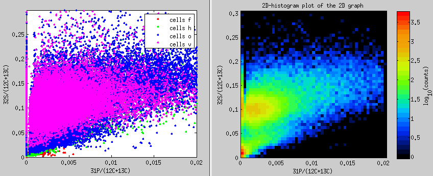
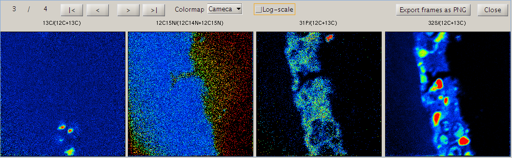
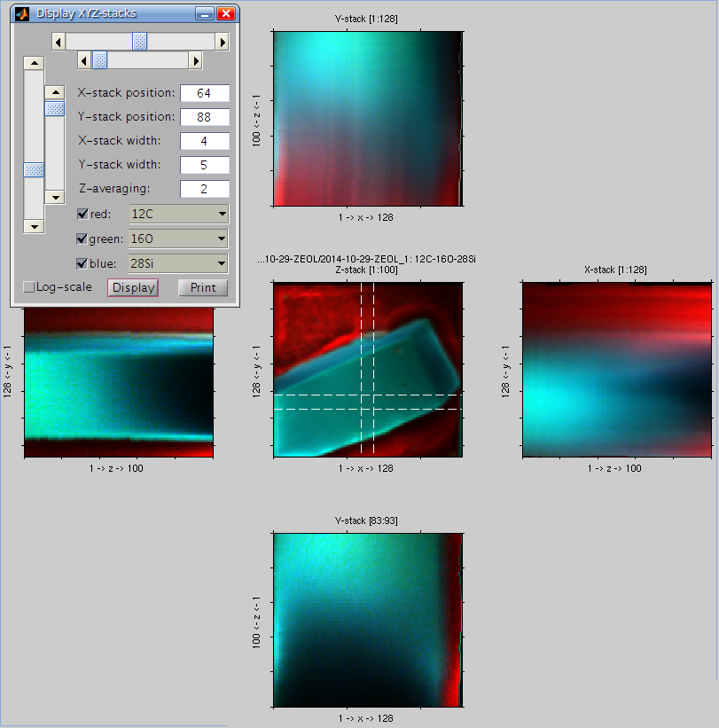
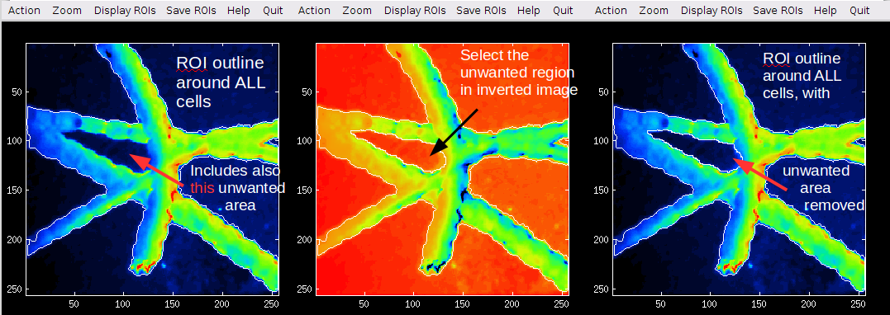
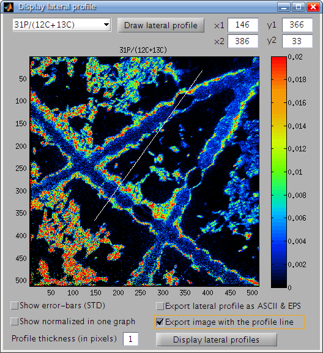
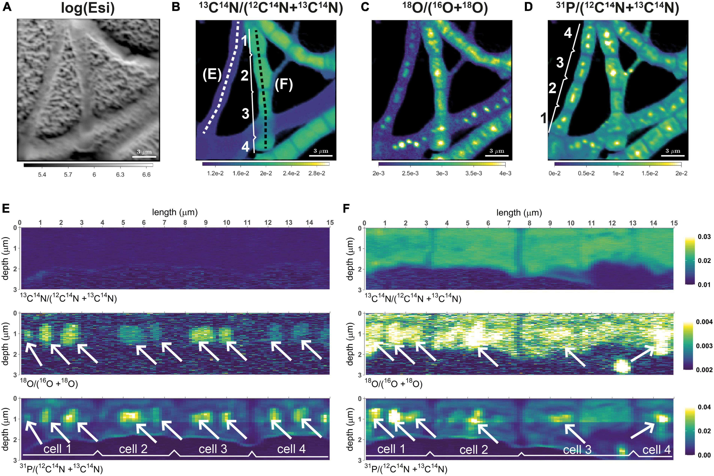

## New features in Look@NanoSIMS

Since its first release in 2011, LANS has been enhanced in numerous ways with features that are useful in different kinds of situations depending on how you wish to look at nanoSIMS data. The **overall approach** to the analysis, however, **has not changed**. Therefore it is recommended that you first look at the manual to get started with the first steps of data processing and analysis with LANS (available from this [Dropbox folder](https://www.dropbox.com/sh/gyss2uvv5ggu2vl/AABViAmt9WHryEP_xZBrCG_La?dl=0)). On this page you will find a list of features that are **not mentioned in the manual**. Many of them are explained in greater detail to ensure you understand how to use them correctly. The text is written in a kind of Q&A style.

### Suppressing the visibility of noise in ratio images in pixels with low ion counts

The images of ion counts (e.g., 12C14N and 12C15N) look beautiful, but when I display a ratio image (e.g., 12C15N/12C14N), there is lots of noise in pixels where the ion counts are low. How can I overcome this?

One way to overcome this is by *modulating the intensity of the hue* (i.e., the brightness of the colors) with a value derived from the ion counts. The effects are demonstrated in the figure below: the left panel shows the 12C15N/12C14N ratio image with a lot of noise. When the intensity of the color is multiplied by a value derived from 12C14N ion counts, which are very low in the noisy areas, the result will look as shown in the right panel: the noise is still there, but much less visible to an unaided eye. [Learn how to do this.](hue_intensity_correction)

  

### Working with external images

In addition to nanoSIMS images, I have imaged the same field of view (FOV) also with another instrument (e.g., fluorescence microscope, AFM, SEM, TEM). I would like to analyze these images together. More specifically, I would like to align them, overlay them, extract lateral profiles, use them as a mask for ROIs definition, etc. [Learn how to do this.](working_with_external_images)

  

### Auto-processing multiple datasets

I have analyzed multiple nanoSIMS datasets. For each dataset I accumulated the planes (sometimes with, sometimes without the drift-correction applied), defined and classified ROIs, and exported images and data in ROIs for 13C/12C and 12C15N/12C14N ratios. However, now I realize that I also need to calculate and analyze the 31P/32S ratios as well as the cell sizes. Plus I would like to display all ratio images together, using a unified scale for all images for a given ratio. [Learn how to do this without re-processing each file separately.](auto_process_datasets)

### Depth profiles in ROIs from multiple datasets

I have analyzed multipled datasets. In each dataset I defined ROIs, classified them, and calculated 13C/12C and 12C15/12C15N ratios in each ROI. Now I realize that I also need to check depth profiles of these ratios in each ROI to quantify their vertical variability within the sample. I could do it by reprocessing each dataset again, but I think there should be a more efficient/automated way, e.g., using the metafile processing feature of LANS. [Learn how to do this.](depth_profiles_multiple_datasets)

### Display ROIs with a specific ID or from a specific class

I have defined many ROIs and classified them into classes. After I made a scatter plot of ratios in these ROIs, I identified a few 'odd' data points. I would like to quickly display the ROIs corresponding to these 'odd' data points. 

#### Quick answer:

In the Interactive ROIs definition tool, click on Display ROIs in the menu. In the window that pops up, specify the ID numbers of ROIs (separated by space) and ID letters of ROI classes that you wish to display. Enter empty to display all defined ROIs. The results will look similar as shown in the figure below.

  

### Annotated scatter plots

When processing multiple NanoSIMS data sets, I end up with a scatter plot of ratios in many different ROIs for several different treatments. I would like to be able to *interact with this scatter plot*, for example, by being able to click on a data point to find its identity and origin. [Learn how to do this.](depth_profiles_multiple_datasets)

  

### Scatter plots of ratios, pixel-by-pixel

I would like to display a scatter plot with ratios. However, I want to show the ratios pixel-by-pixel, i.e., derived from ion counts in individual pixels separately rather than derived from ion counts *accumulated* over ROI pixels. Additionally, I only want to show these values in pixels that belong to ROIs that I have drawn, using different colors for different classes. [Learn how to do this.](pixel_by_pixel_scatter_plots)

  

### Scatter plots in ROIs from specific classes

I have defined many ROIs and classified them into several classes. When I display a scatter plot of ratios in these ROIs, the graph looks overcrowded due to too many data points. I would like to focus my attention separately on ROIs from specific classes, leaving the ROIs from other classes out of the scatter plot. How can I do that?

#### Quick answer:

There is a text field "For classes" in the main LANS GUI. Type here the *identification letters* of the ROI classes you want to display in the scatter plot. When displaying the scatter plot, only data points corresponding to ROIS from these classes will be shown. For example, if you have three classes --- *a*, *b* and *c* --- and you only want to display data points for ROIs from classes *a* and *c*, type *ac* in the text field "For classes" and display the scatter plot again.

### Display ratios for each plane

Seeing ratio images calculated from accumulated ion images is nice, but because I expect depth variation I would like to look at the *ratio images separately for each plane*. How can I do that?

#### Quick answer:

Select *Output → Display ratios for each plane* from the main LANS GUI. This will open a dedicated GUI (see image below), where you can navigate through the different planes, select a colormap, and export each or all planes in a PNG graphic format. The color scaling of the images is determined based on the values given in the corresponding *scale* fields of the main LANS GUI. 

  

### Processing of huge IM files

I have a very large *.im file (e.g., 2 Gb) and my computer does not seem to be able to process it at once, most likely due to limited memory. I would like to process the data in parts, for example by loading only specific masses or specific planes. [Learn how to do this.](huge_files)

### Loading IM files in blocks, merging multiple IM files

I acquired ion count images from the same field of view (FOV) several times. Now I would like to merge these multiple *.im files and analyze them at once. If possible, I would also like to load them in blocks (e.g., 25 planes per block) to be able to display depth profiles of ratios. [Learn how to do this.](process_multiple_im_blocks)

### Display XYZ stacks

Nanosims data acquired in the image mode form a 3-dimensional data-cube, where the detected ion counts vary as a function of the lateral (X and Y) and vertical (Z) co-ordinates. I would like to be able to display this variation. [Learn how to do this.](display_xyz_stacks)

  

### Definition of ROIs through a logical expression

I would like to define ROIs (regions of interest) as contiguous groups of pixels that satisfy a certain condition. For example, I want to use the 12C14N image as a template for ROI definition, and define ROIs by selecting all pixels where the accumulated 12C14N- ion counts are larger than 3000. [Learn how to do this.](rois_logical_expression)

### Interactive thresholding on an inverted image

In the *Interactive ROI definition tool* I use a lot the interactive thresholding function to define ROIs corresponding to the bright areas in my ion image. However, sometimes the bright areas have a dark spot inside it, which I would like to remove by the same interactive thresholding approach. In the standard approach, I don't seem to be able to do this because this function marks a contour around a “hill” rather than a “valley” in the image data.

#### Quick answer:

In the Action menu of the Interactive ROI definition tool, there is a new item named Invert template image. If you select it, the image based on which you define ROIs will be inverted, meaning that hills will become valleys and vice versa. After doing this, you can use the Interactive thresholding function from the menu to define the ROIs as you are used to. Note, however, that the present value of the threshold may be too high or too low for getting a good ROI outline straight away. In this case, press arrow up or down while performing the interactive thresholding function to modify the threshold and thus change the shape and size of the defined ROI. 

  

### Definition of lateral profiles by co-ordinates

I am able to define the line for plotting lateral profiles of ion counts and ratios using a mouse. Although this is mostly sufficient, sometimes I need to define this line more accurately using co-ordinates of the start and end points of the line. How can I do that?

#### Quick answer:

This is done by entering the co-ordinate values in the [x1,y1] and [x2,y2] fields in the GUI used for plotting of lateral profiles (see image below).

  

### Removing multiple ROIS based on size

I have too many ROIs with size in a specific range and I would like to remove them all at once. For example, I want to remove all ROIs that are smaller than 5 pixels. [Learn how to do this.](remove_rois_based_on_size)

### Depth profile along a lateral profile

I have measured ion counts in the same FOV (field of view) over multiple scans (each containing 1000 planes) until the biomass was, essentially, completely eroded. I would like to visualize the depth distribution of the isotope ratio along a specific lateral profile within the image. How can I do that?

#### Quick answer:

This feature was applied in the studies of Geerlings et al. (2021, 2022) to visualize the distribution of C and N assimilation and polyphosphate dynamics in cable bacteria. Examples of the output are shown in the following images. [Follow this link](depth_profile_along_lateral_profile.pdf) to learn how to do it in LANS.

  

